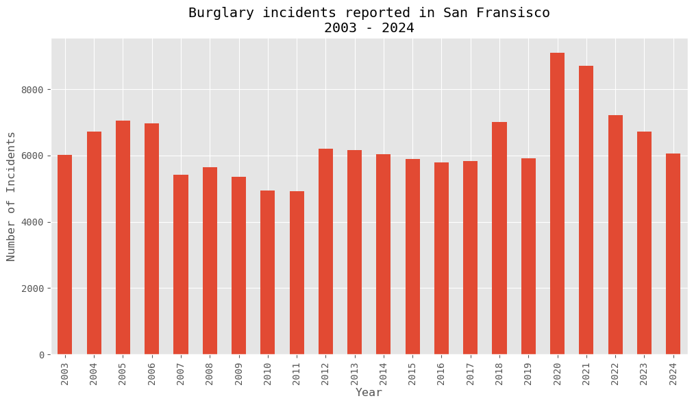

> Disclaimer: This article was written as part of the course [02806 Social data analysis and visualization](https://kurser.dtu.dk/course/02806) taught at DTU in spring 2025 by [Sune Lehmann](https://sunelehmann.com/about/). The assignment description can be found [here](https://github.com/suneman/socialdata2025/blob/main/assignments/Assignment2.ipynb).

A time we all will remember like isolation, keeping our distances and wearing a face-mask is no longer a everyday problem, but rather a part of the history [^1]. But although the pandemic remains in the history, it's worthwile to make a short analysis on how the pandemic affected the count of crimes in San Fransisco. Although previous statistics and analyses have shown how the pandemic caused more burglaries [^2], this article aims to explores the count of burglaries in San Fransisco additionally, specifically over the years during the Covid-19 pandemic. The article explains the trend over time from 2019 till today. The data used is retrieved from the [San Francisco Open Data](https://datasf.org/opendata/), containing SFPD burglary incidents which have been recorded back since January 2003.

# Burglaries during COVID-19

Burglaries is a crime that has been reported frequently in San Fransisco, but never have the trends been so high as during the pandemic and the years coming after. The graph below displays the number of reported burglaries in San Fransisco, over the period of time from 2003 to 2024. The first case of COVID-19 in the San Francisco Bay Area was confirmed in Santa Clara County on January 31, 2020, and exactly this year there was a huge spike in the graph, showing an increase in 53.5 %, from 5922 reported incidents in 2019 and 9092 reported incidents in 2020 [^1].

<figure>
    
    <figcaption style="text-align: center;">Figure 1: Total reported offenses of burglaries in San Fransisco, 2003 to 2024. The spike in 2020 shows an increase of 53.5%; going from 5922 reported incidents pre-COVID-19 to 9092 reported incidents during COVID-19.</figcaption>
</figure>

But what caused the count of burglaries to rise in San Fransisco during the COVID-19 pandemic? And what neighbourhoods were mostly affected by this?

## Affected neighbourhoods

The interactive map below shows the trends in the different neighbourhoods in San Fransisco, having 2019 as the "base" year, meaning that a increase or decrease in the number of reported burglaries is calculated from the initial value in 2019. As the map indicates, some districts were more affected than other. Especially Park, Northen, Richmond and Mission were the mostly affected, containing a percentage rise in the count of burglaries ranging from 80% to 125% just from 2019 to 2020. There is a overall trend in increasing counts of burglaries throughout the years 2019 - 2022, before some areas (such as Central, Southern and Bayview) begin to decrease again in 2023 and 2024. The map allows you to explore the trends over time from 2019 to 2024, and as time passes and COVID-19 becomes a part of our history instead of our everyday life, the map turns more green/orange, hopefully indicating a decrease in burglary, although the reported incidents in 2024 remain larger than in 2019. 

<figure>
    <iframe src="../misc/sf-districts.html" width="100%" height="600px" style="border:none;"></iframe>
    <figcaption style="text-align: center;">
        Figure 2: Map of San Fransisco showing trends in the neighbourhoods from 2018 to 2024. The values on the map are calculated as a percentile value based on the 2019 (pre-COVID-19) statistics. This means that an increase or decrease in the total number of reported burglaries are calculated from the initial value in 2019.
    </figcaption>
</figure>

However, it's still worth to notice that there are specific areas that haven't achieved a decrease from 2019 to today. These areas include Taraval, Richmond, Mission and Ingleside. The following graph allows you to explore the data in a bar-chart from 2019 to 2024, where the values have been normalised in order to show the trends over time. Each district is available as an option on the legend, and clicking a district will display it on the graph. This allows to explore the trends by choosing different combinations of district. Try picking Central and Taraval and see the difference!

<figure>
    <iframe src="../misc/bokeh_plot.html" width="100%" height="600px" style="border:none;"></iframe>
    <figcaption style="text-align: center; font-style: italic;">
        Figure 3: Reported burglaries in San Fransisco, showing the trend in the different districts over time during the COVID-19 pandemic. Values are normalised to show trends.
    </figcaption>
</figure>

# Comments

> I'd like to take this opportunity to explain that during my research for other litterature, I stumbled upon several interesting articles by Susan Nielson, an author at the San Fransisco Cronicle [^2][^3][^4]. However unfortunately they were unavailable to me, due to restricted access to the website. I was only able to read the headings and short summary, before being prompted with a pop-up, requiring a paid subscription. So although I managed to find some resources, I was unable to fully dig into them, but I could clearly see that I was not the only one who had gotten an interest in this particular topic. Therefore I think it's worthwile to mention these references I found.

# References
[^1]: [Wikipedia: COVID-19 pandemic in the San Francisco Bay Area](https://en.wikipedia.org/wiki/COVID-19_pandemic_in_the_San_Francisco_Bay_Area#:~:text=The%20San%20Francisco%20Bay%20Area%2C%20which%20includes%20the%20major%20cities,County%20on%20January%2031%2C%202020.)
[^2]: S. Nielson: *San Francisco crime rates drastically shifted in the pandemic. These charts show what’s happening now.* Published: 06 Feb 2023. [Link accessed 30 Mar 2025](https://www.sfchronicle.com/crime/article/san-francisco-crime-rate-17065509.php).
[^3]: S. Nielson: *San Francisco’s crime rates shifted dramatically in 2020. Five charts show what’s going on.* Published: April 2, 2021. [Link accessed 30 Mar 2025](https://www.sfchronicle.com/local/article/San-Francisco-s-crime-rates-shifted-16071268.php)
[^4]: S. Nielson: *Are robberies up in San Francisco? Here’s how 2023 compares with previous years.* Published: July 7 2023. [Link accessed 30 Mar 2025](https://www.sfchronicle.com/bayarea/article/robberies-san-francisco-18185651.php)